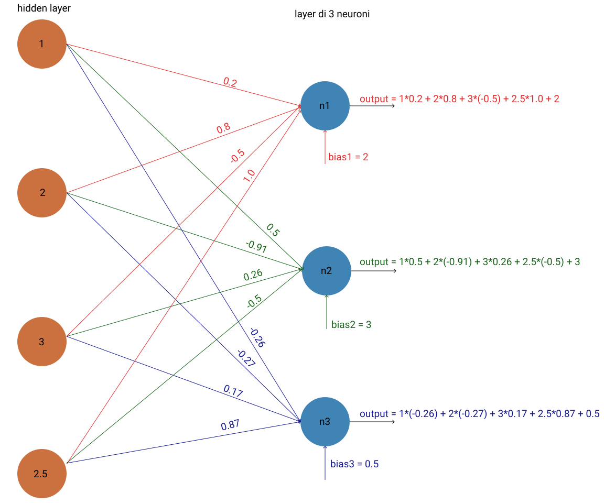

# Reti neurali da zero

 Correttezza spelling nel readme

 Test automatici script python

 Check PEP8

Appunti e traduzione della serie "Neural Networks from Scratch"
su Youtube di sentdex: [clicca qui per accedere al suo canale Youtube](https://www.youtube.com/channel/UCfzlCWGWYyIQ0aLC5w48gBQ)

Per supportare l'autore considerare l'acquisto del
libro dal sito: https://nnfs.io/

Inoltre: guardare anche i suoi video per
usufruire di animazioni, ecc...

> Non sono associato a Sentdex, il suo canale, il suo sito e il suo libro

E' possibile seguire la serie conoscendo altri linguaggi di programmazione
andando sul seguente repository: [clicca qui](https://github.com/Sentdex/NNfSiX)

Notes and translation of the "Neural Networks from Scratch" series.
It's on Youtube and the author is sentdex: [click here to go to his Youtube channel](https://www.youtube.com/channel/UCfzlCWGWYyIQ0aLC5w48gBQ)

To support the author consider buying the book
at this website: https://nnfs.io/

Also: Watch the videos because
they have animations, etc...

> I'm not associated to Sentdex, his channel, his website, his book in any way, shape or form

You can follow the series knowing other programming languages
by going to this repository: [click here](https://github.com/Sentdex/NNfSiX)

---

Obiettivo: capire come funzionano le reti neurali
dalle radici

Requisiti: 
* conoscenze: basi di programmazione e programmazione ad oggetti
* python 3 con numpy(libreria per operazioni matematiche) e matplotlib(visualizzazione grafici)

## Indice
* [Video 1: Intro e codice di un neurone](#video-1-intro-e-codice-di-un-neurone)
	* [Video](https://www.youtube.com/watch?v=Wo5dMEP_BbI)
    * [Codice](code/01_neurone.py)
* [Video 2: codificare un livello](#video-2-codificare-un-livello)
    * [Video](https://www.youtube.com/watch?v=lGLto9Xd7bU)
	* [Codice](code/02_livello.py)
* [Video 3: prodotto interno (dot product)](#video-3-prodotto-interno-dot-product)
    * [Video](https://www.youtube.com/watch?v=tMrbN67U9d4)
    * [Codice video 2 dinamico](code/03.1_livello_codice_dinamico.py)
    * [Codice video 1 numpy](code/03.2_neurone_numpy.py)
    * [Codice video 2 numpy](code/03.3_livello_numpy.py)
* [Video 4: Batch, livelli e programmazione ad oggetti](#video-4-batch-livelli-e-programmazione-ad-oggetti)
    * [Video](https://www.youtube.com/watch?v=TEWy9vZcxW4)
    * [Codice input in batch(gruppi)](code/04.1_batch_input.py)
    * [Codice 2 layer](code/04.2_due_layer.py)
    * [Codice 2 layer in programmazione ad oggetti](code/04.3_oggetto_layer.py)
* [Video 5: Activation function](#video-5-activation-function)
    * [Video](https://www.youtube.com/watch?v=gmjzbpSVY1A)
    * [Codice Relu function](code/05.1_relu_function.py)
    * [Codice Relu function in programmazione ad oggetti](code/05.2_oggetto_relu_function.py)
* [Changelog](#changelog)

> Nota 1: clicca sui titoli esterni per andare nelle sezioni

> Nota 2: i sottotitoli indentati ai titoli principali portano
a risorse aggiuntive (video, codice, ...)

## Video 1: Intro e codice di un neurone
> Link: https://www.youtube.com/watch?v=Wo5dMEP_BbI

### Introduzione
Una rete neurale ha dei dati in input.

Ogni dato (proveniente da un input o da un neurone) e' legato
ad altri neuroni: ogni legame ha il proprio peso ("weight").

Il dato viene moltiplicato per il peso e sommato
a tutti gli altri risultati di moltiplicazione dato-peso.

Infine questo dato viene sommato ad un errore statistico("bias") e
viene passato ad una funzione di attivazione ("activation function").
> l'attivazione e' la simulazione dell'impulso di un neurone naturale


Questo passaggio viene ripetuto per tutti gli strati (i "layer").

Dal risultato viene ottenuta la perdita/errore ("loss"), cioe' quanto sbaglia
la rete neurale: questa informazione ci permette di migliorare la rete neurale.


Tutti i calcoli matematici sono fonte di logaritmi, esponenziali, somme, ...
calcoli infinitesimali e algebra lineare.

In una rete neurale:
* sono presenti i neuroni, connessi insieme
* strato di input ("input layer")
* strati nascosti ("hidden layer")
* strato di output ("output layer")

L'obiettivo e' prevedere attraverso un nuovo input quale e' l'output desiderato.
Per farlo viene utilizzato il processo di apprendimento ("training process") in cui
vengono modificati i pesi dei collegamenti e gli errori statistici.

La rete neurale e' quindi formato da neuroni di piu' strati tutti
collegati fra loro e ogni collegamento, grazie ai pesi, permette
di avere diversi parametri e relazioni.

La parte piu' difficile da capire di una rete neurale e' come
modificare i pesi dei singoli collegamenti.

### Codice di un neurone


Consideriamo 3 neuroni che mandano il proprio
output al nostro neurone:
```python
inputs = [1.2, # output neurone 1
          5.1, # output neurone 2
          2.1  # output neurone 3
]
```

Se abbiamo 3 neuroni che passano dati
al nostro neurone abbiamo 3 collegamenti,
ognuno con il proprio peso:
```python
weights = [3.1, # peso collegamento neurone 1 - nostro neurone
           2.1, # peso collegamento neurone 2 - nostro neurone
           8.7  # peso collegamento neurone 3 - nostro neurone
]
```

Ogni neurone, quindi anche il nostro,
ha un errore statistico:
```python
bias = 3 # errore statistico
```

Il compito del neurone e' moltiplicare i dati
per il peso del collegamento, sommare i risultati
fra di loro e con l'errore statistico:
```python
output = inputs[0] * weights[0] + inputs[1] * weights[1] + inputs[2] * weights[2] + bias
```
Questo e' l'output del neurone: 35.7

Codice completo:
```python
inputs = [1.2, # output neurone 1
          5.1, # output neurone 2
          2.1  # output neurone 3
]

weights = [3.1, # peso collegamento neurone 1 - nostro neurone
           2.1, # peso collegamento neurone 2 - nostro neurone
           8.7  # peso collegamento neurone 3 - nostro neurone
]

bias = 3 # errore statistico

output = (inputs[0] * weights[0] +  # dato neurone 1 moltiplicato per peso collegamento 
          inputs[1] * weights[1] +  # dato neurone 2 moltiplicato per peso collegamento
          inputs[2] * weights[2] +  # dato neurone 3 moltiplicato per peso collegamento
          bias)                     # tutte moltiplicazioni sommate insieme con l'errore statistico.
```
> Il codice completo e' disponibile al percorso: [```code/01_neurone.py```](code/01_neurone.py)


[Torna all'indice](#indice)

---

## Video 2: codificare un livello
> Link: https://www.youtube.com/watch?v=lGLto9Xd7bU



Il video inizia partendo dal codice dell'altra volta (con valori modificati):
> Nota: i numeri sono inventati quindi il fatto che siano
        diversi non implica ragionamenti diversi sul funzionamento del neurone

```python
inputs = [1, # output neurone 1
          2, # output neurone 2
          3  # output neurone 3
]

weights = [0.2,  # peso collegamento neurone 1 - nostro neurone
           0.8,  # peso collegamento neurone 2 - nostro neurone
           -0.5  # peso collegamento neurone 3 - nostro neurone
]

bias = 2 # errore statistico

output = (inputs[0] * weights[0] +  # dato neurone 1 moltiplicato per peso collegamento 
          inputs[1] * weights[1] +  # dato neurone 2 moltiplicato per peso collegamento
          inputs[2] * weights[2] +  # dato neurone 3 moltiplicato per peso collegamento
          bias)                     # tutte moltiplicazioni sommate insieme con l'errore statistico.
```

Gli input del neurone possono provvenire dall'input layer (valori "presi dalla realta'")
o da un layer nascosto (valori in output da altri neuroni).

Nel momento in cui aumenta il numero di input del neurone aumenta
della stessa quantita' il numero di pesi (es. 4 input, 4 pesi), 
mentre l'errore statistico e' 1 solo per neurone.


Considerando 3 neuroni con quattro input, ogni neurone ha:
* 4 input
* 4 pesi (1 per input)
* 1 bias (errore statistico)

Dove l'input per ogni neurone e':
```python
inputs = [1,  # input 1
          2,  # input 2
          3,  # input 3
          2.5 # input 4
]
```

In codice:
* i "set di pesi" sono 3:
    ```python
    # pesi collegamenti verso il neurone 1
    weights1 = [0.2,  # peso collegamento input 1 - neurone 1
                0.8,  # peso collegamento input 2 - neurone 1
                -0.5, # peso collegamento input 3 - neurone 1
                1.0   # peso collegamento input 4 - neurone 1
    ]

    # pesi collegamenti verso il neurone 2
    weights2 = [0.5,   # peso collegamento input 1 - neurone 2
                -0.91, # peso collegamento input 2 - neurone 2
                0.26,  # peso collegamento input 3 - neurone 2
                -0.5   # peso collegamento input 4 - neurone 2
    ]

    # pesi collegamenti verso il neurone 3
    weights3 = [-0.26, # peso collegamento input 1 - neurone 3
                -0.27, # peso collegamento input 2 - neurone 3
                0.17,  # peso collegamento input 3 - neurone 3
                0.87   # peso collegamento input 4 - neurone 3
    ]
    ```
* i bias sono 3:
    ```python
    bias1 = 2 # errore statistico neurone 1

    bias2 = 3 # errore statistico neurone 2

    bias3 = 0.5 # errore statistico neurone 3
    ```

Se abbiamo 3 neuroni, e ogni neurone ha 1 output, otterremo un set di 3 output:
```python
output = [  # CALCOLO OUTPUT NEURONE 1
               (inputs[0] * weights1[0] + # dato input 1 moltiplicato per peso collegamento al neurone 1 
                inputs[1] * weights1[1] + # dato input 2 moltiplicato per peso collegamento al neurone 1
                inputs[2] * weights1[2] + # dato input 3 moltiplicato per peso collegamento al neurone 1
                inputs[3] * weights1[3] + # dato input 4 moltiplicato per peso collegamento al neurone 1
                bias1),                   # tutte moltiplicazioni sommate insieme con l'errore statistico del neurone 1.

                # CALCOLO OUTPUT NEURONE 2
               (inputs[0] * weights2[0] + # dato input 1 moltiplicato per peso collegamento al neurone 2 
                inputs[1] * weights2[1] + # dato input 2 moltiplicato per peso collegamento al neurone 2
                inputs[2] * weights2[2] + # dato input 3 moltiplicato per peso collegamento al neurone 2
                inputs[3] * weights2[3] + # dato input 4 moltiplicato per peso collegamento al neurone 2
                bias2),                 + # tutte moltiplicazioni sommate insieme con l'errore statistico del neurone 2.

                # CALCOLO OUTPUT NEURONE 3
               (inputs[0] * weights3[0] + # dato input 1 moltiplicato per peso collegamento al neurone 3 
                inputs[1] * weights3[1] + # dato input 2 moltiplicato per peso collegamento al neurone 3
                inputs[2] * weights3[2] + # dato input 3 moltiplicato per peso collegamento al neurone 3
                inputs[3] * weights3[3] + # dato input 4 moltiplicato per peso collegamento al neurone 3
                bias3),                   # tutte moltiplicazioni sommate insieme con l'errore statistico del neurone 3.
]
```

Output dei neuroni: ```[4.8, 1.21, 2.385]```

Se vogliamo ottenere l'output desiderato la rete neurale:
* NON puo' modificare gli input (sono risultato di calcoli effettuati da altri neuroni o i dati di partenza provenienti ad esempio da sensori, ecc...)
* e' possibile modificare i pesi (weights) e gli errori statistici (bias). Il Deep learning modifica questi valori

Questa parte verra' trattata nei prossimi video

> Il codice completo e' disponibile al percorso: [```code/02_livello.py```](code/02_livello.py)


[Torna all'indice](#indice)

---

## Video 3: prodotto interno (dot product)
> Link: https://www.youtube.com/watch?v=tMrbN67U9d4

Obiettivo: usare liste e matrici nel codice
per renderlo piu' dinamico.

Creare una matrice di pesi:
```python
weights = [
    [
        0.2,  # peso collegamento input 1 - neurone 1
        0.8,  # peso collegamento input 2 - neurone 1
        -0.5, # peso collegamento input 3 - neurone 1
        1.0   # peso collegamento input 4 - neurone 1
    ],

    # pesi collegamenti verso il neurone 2
    [
        0.5,   # peso collegamento input 1 - neurone 2
        -0.91, # peso collegamento input 2 - neurone 2
        0.26,  # peso collegamento input 3 - neurone 2
        -0.5   # peso collegamento input 4 - neurone 2
    ],

    # pesi collegamenti verso il neurone 3
    [
        -0.26, # peso collegamento input 1 - neurone 3
        -0.27, # peso collegamento input 2 - neurone 3
        0.17,  # peso collegamento input 3 - neurone 3
        0.87   # peso collegamento input 4 - neurone 3
    ]
]
```

E una lista di errori statistici:
```python
biases = [2,   # errore statistico neurone 1
          3,   # errore statistico neurone 2
          0.5  # errore statistico neurone 3
]
```

Per il resto del codice:
```python
# output del layer (lista di output dei neuroni)
layer_outputs = []

# scorri unione delle liste dei pesi e dei bias
# > l'unione e' fatta per elemento 
# > (es. elemento 0 di weights e elemento 0 di biases sono il primo array,
# >      elemento 1 di weights e elemento 1 di biases sono il secondo array, ...)
for neuron_weights, neuron_bias in zip(weights, biases):
    # output nel neurone
    neuron_output = 0
    
    # scorri unione degli input e dei pesi
    for n_input, weight in zip(inputs, neuron_weights):
        neuron_output += n_input * weight  # moltiplica (input * peso) per input e sommali
    
    # somma l'errore statistico
    neuron_output += neuron_bias

    # aggiungi il risultato alla lista degli output del layer
    layer_outputs.append(neuron_output)
```

> Il codice completo e' disponibile al percorso: [```code/03.1_livello_codice_dinamico.py```](code/03.1_livello_codice_dinamico.py)


Di cosa si occupano i pesi e gli errori statistici:
* i pesi amplificano (/attenuano) un certo input
* l'errore statistico compensa il risultato (esegue un offset)

Questi pesi e errori statistici permettono di ottenere l'output
desiderato.

### Il concetto di "Shape"
E' la dimensione di una lista, lista di liste,...

Esempio:
una lista di quattro elementi:
```python
l = [1, 5, 6, 2]
```
Ha come "Shape": ```(4)```

perche' e' una lista (di una dimensione) di 4 elementi


Se due liste sono contenute in una lista (matrice, array di due dimensioni):
```python
lol = [
    [1, 5, 6, 2],
    [3, 2, 1, 3]
]
```
Ha come "Shape": ```(2, 4)```

perche' e' una matrice di due dimensioni (contiene due liste)
e che a loro volta hanno 4 elementi.

Attenzione: le liste devono essere omologhe,
non possono esserci liste di dimensioni diverse
come ad esempio:
```python
lol = [
    [1, 5, 6, 2],
    [3, 2, 1]
]
```


Se ho 3 liste che contengono ciascuna due liste
di elementi (array di 3 dimensioni):
```python
lolol = [
    
    [
        [1, 5, 6, 2],
        [3, 2, 1, 3]
    ],

    [
        [5,2,1,2],
        [6,4,8,4]
    ],

    [
        [2,8,5,3],
        [1,1,9,4]
    ]
    
]
```
Ha una "Shape": ```(3, 2, 4)```.

Un tensore ("tensor"), usato nel deep learning, puo' essere rappresentato
come un array di array

### Prodotto interno - dot product
In matematica l'operazione di prodotto
interno consiste nel prendere in
ordine gli elementi di due vettori,
di moltiplicare gli elementi e infine
di sommare i risultati.

Il risultato e' un valore.

Esempio:
```python

a= [1, 2, 3]
b = [2, 3, 4]

dot_product = a[0]*b[0] + a[1]*b[1] + a[2]*b[2]
#              1  * 2   +  2 * 3    +  3 *  4
#                 2     +    6      +    12
# 
# dot_product = 20
```


Per eseguire il prodotto interno
di un neurone utilizzando la libreria numpy:
```python
# possiamo richiamare oggetti (funzioni,...) numpy facendo np.x(),...
import numpy as np

inputs = [1, 2, 3, 2.5]
weights = [0.2, 0.8, -0.5, 1.0]
bias = 2

# prodotto interno
output = np.dot(weights, inputs) + bias
```
> nota: in questo caso, poiche' input e pesi sono entrambi
> vettori, e' possibile invertire gli argomenti della funzione
> ma e' meglio passare prima i pesi e poi gli input

> Il codice completo e' disponibile al percorso: [```code/03.2_neurone_numpy.py```](code/03.2_neurone_numpy.py)

Per eseguire il prodotto interno
di un layer utilizzando numpy:
```python
# possiamo richiamare oggetti (funzioni,...) numpy facendo np.x(),...
import numpy as np

inputs = [1, 2, 3, 2.5]
weights = [
    [
        0.2,  # peso collegamento input 1 - neurone 1
        0.8,  # peso collegamento input 2 - neurone 1
        -0.5, # peso collegamento input 3 - neurone 1
        1.0   # peso collegamento input 4 - neurone 1
    ],

    # pesi collegamenti verso il neurone 2
    [
        0.5,   # peso collegamento input 1 - neurone 2
        -0.91, # peso collegamento input 2 - neurone 2
        0.26,  # peso collegamento input 3 - neurone 2
        -0.5   # peso collegamento input 4 - neurone 2
    ],

    # pesi collegamenti verso il neurone 3
    [
        -0.26, # peso collegamento input 1 - neurone 3
        -0.27, # peso collegamento input 2 - neurone 3
        0.17,  # peso collegamento input 3 - neurone 3
        0.87   # peso collegamento input 4 - neurone 3
    ]
]


biases = [2,   # errore statistico neurone 1
          3,   # errore statistico neurone 2
          0.5  # errore statistico neurone 3
]

# prodotto interno
output = np.dot(weights, inputs) + biases
```
> Il codice completo e' disponibile al percorso: [```code/03.3_livello_numpy.py```](code/03.3_livello_numpy.py)

In questo caso è necessario passare prima i pesi
e poi gli input perche' numpy fornisce un output
in base alla struttura del primo parametro passato:
passando una matrice con 3 array indico che ci sono
3 risultati, uno per neurone.

Internamente numpy calcola i prodotti interni
tra i vettori nella matrice e il vettore degli input:
```python
np.dot(weights, inputs) = [
    np.dot(weights[0], inputs), # prodotto interno tra pesi neurone 1 e input
    np.dot(weights[1], inputs), # prodotto interno tra pesi neurone 2 e input
    np.dot(weights[2], inputs)  # prodotto interno tra pesi neurone 3 e input
]
```

Dopo aver calcolato il vettore dei prodotti interni
vengono sommati gli errori statistici:
prodotto interno 0 con errore statistico 0,
prodotto interno 1 con errore stat. 1,
prodotto interno 2 con errore stat. 2

[Torna all'indice](#indice)

---

## Video 4: Batch, livelli e programmazione ad oggetti
> Link: https://www.youtube.com/watch?v=TEWy9vZcxW4

Convertire il codice in batch permette di parallelizzare
i calcoli...
> piu' batch permettono piu' parallelizzazioni e per eseguire
> i calcoli nel deep learning si preferisce utilizzare la potenza di calcolo delle schede video
> perche' hanno piu' core rispetto a un processore

...e permette di generalizzare (generalization)
il sistema: la rete neurale non si adattera' ad un singolo set
di input ma imparera' da piu' set di dati.

Non bisogna esagerare con la dimensione del batch:
passandogli tutti i set la rete neurale si adattera' perfettamente
solo a comprendere i dati del set stesso con cui sta "imparando"
e nel momento in cui gli passiamo dati mai visti otterremo un pessimo risultato.

Una dimensione tipica del batch e' 32 o 64, raramente 128 sample.

Riprendendo il codice dell'altro video:
```python
# possiamo richiamare oggetti (funzioni,...) numpy facendo np.x(),...
import numpy as np

inputs = [1, 2, 3, 2.5]
weights = [
    [
        0.2,  # peso collegamento input 1 - neurone 1
        0.8,  # peso collegamento input 2 - neurone 1
        -0.5, # peso collegamento input 3 - neurone 1
        1.0   # peso collegamento input 4 - neurone 1
    ],

    # pesi collegamenti verso il neurone 2
    [
        0.5,   # peso collegamento input 1 - neurone 2
        -0.91, # peso collegamento input 2 - neurone 2
        0.26,  # peso collegamento input 3 - neurone 2
        -0.5   # peso collegamento input 4 - neurone 2
    ],

    # pesi collegamenti verso il neurone 3
    [
        -0.26, # peso collegamento input 1 - neurone 3
        -0.27, # peso collegamento input 2 - neurone 3
        0.17,  # peso collegamento input 3 - neurone 3
        0.87   # peso collegamento input 4 - neurone 3
    ]
]


biases = [2,   # errore statistico neurone 1
          3,   # errore statistico neurone 2
          0.5  # errore statistico neurone 3
]

# prodotto interno
output = np.dot(weights, inputs) + biases
```

Per aumentare i batch occorre rendere la lista di input...
```python
inputs = [1, 2, 3, 2.5]
```

una matrice: ho piu' set/sample di input
```python
inputs = [
    [1, 2, 3, 2.5],         # set 1 di input
    [2.0, 5.0, -1.0, 2.0],  # set 2 di input
    [-1.5, 2.7, 2.2, -0.8]  # set 3 di input
]
```

Per calcolare il prodotto interno tra matrici occorre: 
* prendere la prima lista degli input e farne il prodotto interno con la prima colonna dei pesi
* prendere la prima lista degli input e farne il prodotto interno con la seconda colonna dei pesi
* ...
* dopo aver finito i calcoli dei prodotti interni tra la prima lista degli input e le colonne dei pesi
si passa a calcolare la seconda lista degli input per la prima colonna dei pesi, ecc... 

Il risultato e' un'altra matrice.


Se si tenta di eseguire il codice sopra dara' un errore di shaping:
* la matrice di input ha come shaping (3, 4) perche' contiene 3 set di 4 input
* la matrice di pesi ha come shaping (3, 4) perche' contiene 3 set di 4 pesi
* nel momento in cui si esegue il prodotto interno tra le matrici il programma cerca 
fare il prodotto interno di 4 pesi per i 3 set, causando errore (devono essere omologhi)

> il problema si presenta anche se tento di modificare l'ordine di parametri passati
> a np.dot() perche' le shape rimangono uguali

Per risolvere questo problema occorre invertire le righe e le colonne dei pesi per riottenere
la parita' di elementi con cui fare il prodotto interno.

Il processo che inverte righe e colonne si chiama "transpose".

Per farlo bisogna cambiare il codice:
```python
output = np.dot(inputs, weights) + biases
# oppure
# output = np.dot(weights, inputs) + biases
```
In:
```python
output = np.dot(inputs, np.array(weights).T) + biases
```
Dove: 
* ```np.array()``` converte la lista python in un array di numpy
* la ```.T``` in ```np.array(weights).T``` scambia righe e colonne
* la somma degli errori statistici prende le singole righe del prodotto interno
tra matrici e somma ogni elemento con l'errore statistico dello stesso indice
(primo elemento della prima riga sommato al primo errore statistico, 
secondo elemento prima riga sommato al secondo errore statistico,
...,
primo elemento della seconda riga sommato al primo errore statistico,
ecc...)

> Il codice completo e' disponibile al percorso: [```code/04.1_batch_input.py```](code/04.1_batch_input.py)

### due layer
Senza usare la programmazione ad oggetti occorre
duplicare i pesi e gli errori statistici
```python
# possiamo richiamare oggetti (funzioni,...) numpy facendo np.x(),...
import numpy as np

inputs = [
    [1, 2, 3, 2.5],         # set 1 di input
    [2.0, 5.0, -1.0, 2.0],  # set 2 di input
    [-1.5, 2.7, 2.2, -0.8]  # set 3 di input
]

# pesi del layer 1
weights = [
    # pesi collegamenti verso il neurone 1
    [
        0.2,  # peso collegamento input 1 - neurone 1 (layer 1)
        0.8,  # peso collegamento input 2 - neurone 1 (layer 1)
        -0.5, # peso collegamento input 3 - neurone 1 (layer 1)
        1.0   # peso collegamento input 4 - neurone 1 (layer 1)
    ],

    # pesi collegamenti verso il neurone 2
    [
        0.5,   # peso collegamento input 1 - neurone 2 (layer 1)
        -0.91, # peso collegamento input 2 - neurone 2 (layer 1)
        0.26,  # peso collegamento input 3 - neurone 2 (layer 1)
        -0.5   # peso collegamento input 4 - neurone 2 (layer 1)
    ],

    # pesi collegamenti verso il neurone 3
    [
        -0.26, # peso collegamento input 1 - neurone 3 (layer 1)
        -0.27, # peso collegamento input 2 - neurone 3 (layer 1)
        0.17,  # peso collegamento input 3 - neurone 3 (layer 1)
        0.87   # peso collegamento input 4 - neurone 3 (layer 1)
    ]
]

# errori statistici layer 1
biases = [2,   # errore statistico neurone 1 (layer 1)
          3,   # errore statistico neurone 2 (layer 1)
          0.5  # errore statistico neurone 3 (layer 1)
]

# pesi del layer 2
weights2 = [
    [
        0.1,    # peso collegamento neurone 1 (layer 1) - neurone 1 (layer 2)
        -0.14,  # peso collegamento neurone 2 (layer 1) - neurone 1 (layer 2)
        0.5,    # peso collegamento neurone 3 (layer 1) - neurone 1 (layer 2)
    ],

    # pesi collegamenti verso il neurone 2
    [
        -0.5,   # peso collegamento neurone 1 (layer 1) - neurone 2 (layer 2)
        0.12,   # peso collegamento neurone 2 (layer 1) - neurone 2 (layer 2)
        -0.33,  # peso collegamento neurone 3 (layer 1) - neurone 2 (layer 2)
    ],

    # pesi collegamenti verso il neurone 3
    [
        -0.44,  # peso collegamento neurone 1 (layer 1) - neurone 3 (layer 2)
        0.73,   # peso collegamento neurone 2 (layer 1) - neurone 3 (layer 2)
        -0.13,  # peso collegamento neurone 3 (layer 1) - neurone 3 (layer 2)
    ]
]

# errori statistici layer 2
biases2 = [
    -1,   # errore statistico neurone 1 (layer 2)
    2,    # errore statistico neurone 2 (layer 2)
    -0.5  # errore statistico neurone 3 (layer 2)
]

# prodotto interno tra input e pesi dei neuroni del livello 1 + errori statistici livello 1:
# output dei neuroni del layer 1
layer1_output = np.dot(inputs, np.array(weights).T) + biases

# prodotto interno tra output del layer1 e pesi dei neuroni del livello 2 + errori statistici livello 2:
# output dei neuroni del layer 2
layer2_output = np.dot(layer1_output, np.array(weights2).T) + biases2
```

> Il codice completo e' disponibile al percorso: [```code/04.2_due_layer.py```](code/04.2_due_layer.py)

A questo punto e' possibile aggiungere altri livelli allo stesso
modo ma diventa tedioso: e' piu' semplice utilizzare la programmazione ad oggetti

### Programmazione ad oggetti
Partiamo dagli stessi input ma cambiamo il nome
della variabile in ```X``` per seguire lo standard piu' 
diffuso degli script con reti neurali:
```python
# possiamo richiamare oggetti (funzioni,...) numpy facendo np.x(),...
import numpy as np

X = [
    [1, 2, 3, 2.5],         # set 1 di input
    [2.0, 5.0, -1.0, 2.0],  # set 2 di input
    [-1.5, 2.7, 2.2, -0.8]  # set 3 di input
]
```

Ora occorre creare un oggetto dell'hidden layer
> hidden perche' non e' direttamente modificabile
> dal programmatore

```python
class Layer_Dense:

    def __init__(self):
        pass
    def forward(self):
        pass
```

Quando inizializziamo un layer potremmo:
* avere gia' un modello (trained model) salvato
e dobbiamo caricarlo nel programma: in pratica
vengono salvati su file i valori dei pesi
e degli errori statistici
* viene creata una nuova rete neurale:
    * occorre inizializzare i pesi: valori casuali tra -1 e 1.
    Vogliamo un range piccolo di valori perche' desideriamo
    un risultato che tende a uno dei valori massimi/minimi.
    In caso di valori grandi potremmo trovarci nella situazione in cui questi vengono
    moltiplicati per dei pesi grandi che potrebbero essere
    a sua volta moltiplicati per pesi grandi,...
    Occorre normalizzare i dati in ingresso (metterli in proporzione per ridurre il range di valori)
    e "espanderlo" (eseguire uno scale): modificare il valore per mantenergli lo stesso
    significato ma ridurre il range di valori

    * occorre inizializzare gli errori statistici: in genere sono inizializzati a 0.
    In certi casi si desidera avere valori diversi: se ho una moltiplicazione che produce
    uno zero, lo sommo a 0 ottengo zero, il risultato lo moltiplico ecc...
    Propago nella rete il risultato zero: la rete e' "morta"

In codice:
utilizziamo numpy per produrre valori di peso random
> per comodita' otteniamo sempre gli stessi risultati impostando il seed
```python
import numpy as np

np.random.seed(0) # imposta seed per generare gli stessi valori
```

E per il layer:
```python
class Layer_Dense:

    def __init__(self, n_inputs, n_neurons):
        # chiediamo al programmatore il numero di input in un set del batch e di neuroni
        # per creare una matrice di pesi di <n_inputs> righe e <n_neurons> colonne
        # Moltiplichiamo i valori per 0.10 per ridurre il valore dei pesi
        # > randn(): distribuzione gaussiana attorno a 0
        # > e i suoi parametri producono la shape
        self.weights = 0.10 * np.random.randn(n_inputs, n_neurons)

        # creiamo una "matrice" di 0 con una riga e tante colonne/zeri quanti sono i neuroni
        # > occorre passare la shape come array: (x, y)
        self.biases = np.zeros((1, n_neurons))

    def forward(self):
        pass
```

Adesso che abbiamo il controllo dei pesi non occorre piu'
usare il numero di neuroni per il numero di input per creare
la matrice perche' calcoliamo il prodotto interno
tra input e pesi invece di calcolare il prodotto interno
tra pesi e input
> In caso contrario sarebbe necessario scambiare righe e colonne (transpose)
> ogni volta che utilizziamo i pesi nel metodo forward() per problemi
> di shape

Per il metodo forward:
```python
class Layer_Dense:

    def __init__(self, n_inputs, n_neurons):
        # chiediamo al programmatore il numero di input in un set del batch e di neuroni
        # per creare una matrice di pesi di <n_inputs> righe e <n_neurons> colonne
        # Moltiplichiamo i valori per 0.10 per ridurre il valore dei pesi
        # > randn(): distribuzione gaussiana attorno a 0
        # > e i suoi parametri producono la shape
        self.weights = 0.10 * np.random.randn(n_inputs, n_neurons)

        # creiamo una "matrice" di 0 con una riga e tante colonne/zeri quanti sono i neuroni
        # > occorre passare la shape come array: (x, y)
        self.biases = np.zeros((1, n_neurons))

    def forward(self, inputs):
        # <inputs> e' l'output del layer precedente
        self.output = np.dot(inputs, self.weights) + self.biases
```

Per inizializzare gli oggetti della classe del layer:
```python
# 4 = numero di input, 5 = numero di neuroni e quindi di output
layer1 = Layer_Dense(4, 5)

# 5 = input dal layer precedente (5 neuroni), 2 = numero di neuroni e quindi di output
layer2 = Layer_Dense(5, 2)
```

Ora occorre passargli i dati:
```python
# passo gli input al layer1
layer1.forward(X)
# layer1.output e' l'output del layer

# pass l'output del layer 1 al layer 2
layer2.forward(layer1.output)
# layer2.output e' l'output del layer 2
```

> Il codice completo e' disponibile al percorso: [```code/04.3_oggetto_layer.py```](code/04.3_oggetto_layer.py)

Ora la parte piu' importante che manca
e' la funzione di attivazione (activation function)

[Torna all'indice](#indice)

---

## Video 5: Activation function
> Link: https://www.youtube.com/watch?v=gmjzbpSVY1A

Esistono diverse activation function

### Step function
In una step function l'output e' zero se un valore in input x
e' negativo, altrimenti e' uno

Utilizzandola come activation function ogni neurone quindi:
* riceve degli input moltiplicati per il peso dei collegamenti
* somma i prodotti con il bias
* il risultato viene passato alla step function che restituira'
uno zero o un uno

> In genere l'output layer ha una activation function diversa
> da quella degli hidden layer

### Sigmoid function
Ci si e' resi conto che e' piu' affidabile fare training ad una rete neurale 
utilizzando una sigmoid function invece di una step function perche' 
il risultato e' piu' granulare (dettagliato)

Utilizzandola come activation function ogni neurone quindi:
* riceve degli input moltiplicati per il peso dei collegamenti
* somma i prodotti con il bias
* il risultato viene passato alla sigmoid function che restituira'
un risultato tra zero e uno

E' importante avere un risultato piu' dettagliato per calcolare
quanto la rete sbaglia (loss) per poter utilizzare un ottimizzatore
e migliorare la rete.

Se utilizziamo una step function il risultato e' o zero o uno
e l'ottimizzatore non riesce a comprendere quanto il risultato
si distacca tra uno 0 e un 1

### Rectified linear function
Se l'input x e' maggiore di zero, l'output e' x,
altrimenti l'output e' zero.

Utilizzandola come activation function ogni neurone quindi:
* riceve degli input moltiplicati per il peso dei collegamenti
* somma i prodotti con il bias
* il risultato viene passato alla rectified linear function che restituira'
un risultato tra zero e uno

Il risultato e' comunque granulare, l'output e' sempre positivo, maggiore o uguale a zero.
E' migliore rispetto alla sigmoid function perche'
la sigmoid function ha un problema che verra' spiegato piu' avanti.

Viene utilizzata anche perche' e' una funzione piu' semplice di una sigmoid function,
e' molto veloce e funziona bene.


Perche' serve una activation function? 
Nella teoria serve per mimare l'attivazione di un neurone naturale
ma matematicamente a cosa serve?

Se non utilizziamo le activation function il risultato di un neurone
e' lineare.
A livello di rete neurale anche il suo output sarebbe lineare,
e questo va bene per tutte le situazioni in cui l'input e' lineare.

Se l'input non e' lineare questo deve essere approssimato e il
risultato non e' soddisfacente.

Perche' le altre funzioni riescono a dare un buon risultato?
Perche' non sono lineari. La funzione rectified linear
e' molto simile ad una funzione lineare ma si differenzia
abbastanza per essere potente.


Matematicamente un neurone permette:
* di amplificare l'output attraverso il peso del collegamento
* di fare un offset orizzontale dell'output attraverso l'errore statistico

Se il peso e' positivo la funzione si attiva, se e' negativo
la funzione si disattiva.

Aggiungendo un secondo neurone con peso 1 e bias 0 il risultato resta invariato.

Aumentando il bias del secondo neurone avviene un offset verticale dell'output.

Modificando pesi e bias di tutti i neuroni e' possibile ricreare
la funzione dell'output desiderato

### Creare una rectified linear function

Definiamo un vettore di input:
```python
inputs = [0, 2, -1, 3.3, -2.7, 1.1, 2.2, -100]
```
E uno di output:
```python
output = []
```

Utilizziamo un for loop per controllare
se ogni input e' maggiore di zero 
(e allora lo aggiungiamo al vettore output)
o se e' minore o uguale a zero (e allora aggiungiamo zero al vettore output)
```python
for i in inputs:
    if i > 0:
        output.append(i)
    elif i <= 0:
        output.append(0)
```

Un altro metodo di scrivere il codice qui sopra e' trovare il valore
massimo tra zero e i singoli input:
```python
for i in inputs:
    # se 0 e' il valore piu' grande, aggiungi 0
    # altrimenti aggiungi l'input <i>
    output.append(max(0, i))
```

> Il codice completo e' disponibile al percorso: [```code/05.1_relu_function.py```](code/05.1_relu_function.py)

In programmazione ad oggetti
```python
class Activation_ReLU:
    def forward(self, inputs):
        self.output = np.maximum(0, inputs)
```

Installare la libreria nnfs per avere a disposizione
la funzione ```create_data()``` che serve per generare dei dati
da passare alla rete neurale.
> Piu' avanti nella serie si utilizzeranno dati reali

La funzione richiede due parametri:

    create_data(points, classes)

Crea un dataset:
points e' il numero di punti generati (ognuno con coordinate x e y, due feature o input per neurone) o feature set,
mentre classes e' il numero di classi (una classe e' una spirale).
La funzione genera dei punti posizionati seguendo un movimento a spirale.

La funzione e' utilizzabile attraverso la funzione ```spiral_data()``` in questo modo:
```python
from nnfs.datasets import spiral_data

nnfs.init()

# X e' sono i feature set; y sono i label, target o classifications (classi)
X, y = spiral_data(100, 3)
```

Riprendendo il codice:
```python
from nnfs.datasets import spiral_data

nnfs.init()

# X e' sono i feature set; y sono i label, target o classifications (classi)
X, y = spiral_data(100, 3)

class Activation_ReLU:
    def forward(self, inputs):
        # calcola il massimo tra i valori e 0 (tutti i valori negativi "diventano" zeri)
        self.output = np.maximum(0, inputs)

class Layer_Dense:

    def __init__(self, n_inputs, n_neurons):
        # chiediamo al programmatore il numero di input in un set del batch e di neuroni
        # per creare una matrice di pesi di <n_inputs> righe e <n_neurons> colonne
        # Moltiplichiamo i valori per 0.10 per ridurre il valore dei pesi
        # > randn(): distribuzione gaussiana attorno a 0
        # > e i suoi parametri producono la shape
        self.weights = 0.10 * np.random.randn(n_inputs, n_neurons)

        # creiamo una "matrice" di 0 con una riga e tante colonne/zeri quanti sono i neuroni
        # > occorre passare la shape come array: (x, y)
        self.biases = np.zeros((1, n_neurons))

    def forward(self, inputs):
        # <inputs> e' l'output del layer precedente
        self.output = np.dot(inputs, self.weights) + self.biases


# 2 = numero di input, 5 = numero di neuroni e quindi di output
layer1 = Layer_Dense(4, 5)

# creo oggetto della activation function
activation1 = Activation_ReLU()

# passo gli input al layer1
layer1.forward(X)

# passo l'output del layer all'activation function:
# il suo output (activation1.output) contiene solo valori 0 o maggiori di 0
activation1.forward(layer1.output)
```

> Il codice completo e' disponibile al percorso: [```code/05.2_oggetto_relu_function.py```](code/05.2_oggetto_relu_function.py)

[Torna all'indice](#indice)

## Changelog

**Commit 8-9 2020-05-15:** <br>
* Aggiunti alcuni unit test per ```utils.py``` (script ```utils_unittest.py```)
* Aggiunto check automatico PEP8 e dello spelling negli script python (aggiunto workflow ```pep8.yml```)
### idee/todo
* aggiungere altre immagini al README.md
* Aggiungere altri unit test per ```utils.py```

**Commit 7 2020-05-15:** <br>
* aggiunti appunti quinto video
* aggiunto script bash ```testscripts.sh```per eseguire tutti gli script
python nella cartella ```code```
* modificato il file workflow ```testscripts.yml``` per eseguire
lo script bash riportato al punto sopra
* modificato lo script ```spellcheck.sh``` per rimuovere parole duplicate dalla wordlist e dal dizionario custom
* aggiunta libreria nnfs al file ```requirements.txt```: possiede funzioni utili
a generare dataset e rende prevedibile l'output di numpy per mantenere possibile
il troubleshooting per motivi didattici
### idee
* aggiungere immagini: sono tendenzialmente piu' esplicative del semplice testo
* Eseguire unit test delle funzioni in ```utils.py```
* (Nuovo) Aggiungere check automatico PEP8 e dello spelling anche negli script python

**Commit 6 2020-05-03:** <br>
* aggiunti appunti del quarto video
* aggiunto il file ```requirements.txt``` per installare numpy
* rinominato file workflow di github actions ```workflow.yml``` in ```spellcheck.yml```
* aggiunto file workflow ```testscripts.yml``` per assicurare che gli script possano essere eseguiti
e che il risultato sia quello atteso
    > Nota: e' stato aggiunto lo script ```utils.py``` con funzioni adatte al test degli altri script
* sistemato PEP8 degli script del terzo video
### idee
* creare script bash per eseguire script python nella cartella ```code``` senza aggiungerli al file di workflow
* aggiungere immagini: sono tendenzialmente piu' esplicative del semplice testo
* Eseguire unit test delle funzioni in ```utils.py```

**Commit 3-5 2020-04-28:** <br>
* aggiunti appunti del terzo video
* aggiunti i link ai video anche nell'indice
* aggiunto link al repository di github 
con codici in altri linguaggi di programmazione: [link](https://github.com/Sentdex/NNfSiX)
* aggiunti ```<hr>``` di separazione tra i video
* aggiunto script e dizionari per automatizzare il controllo
di errori di scrittura con hunspell

**Commit 2 2020-04-19:** <br>
* Sostituiti i tab in spazi (README e codice)
* Sistemati i link nell'indice
* Aggiunte immagini relative ai primi due video

**Commit 1 2020-04-19:** <br>
Primo commit: appunti dei primi 2 video

[Torna all'indice](#indice)

## Autore
* original author: Sentdex ([Youtube channel](https://www.youtube.com/channel/UCfzlCWGWYyIQ0aLC5w48gBQ))
* notes and translation: mario33881